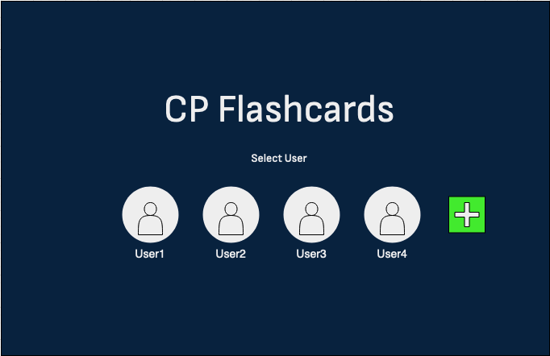
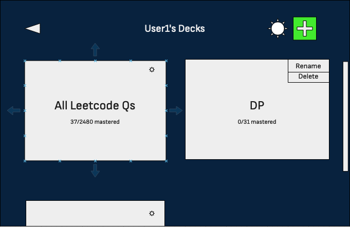
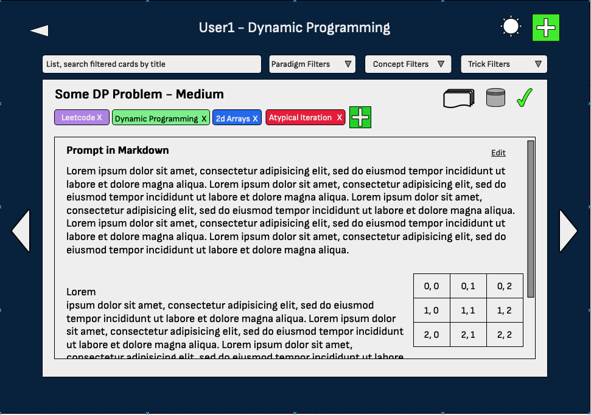
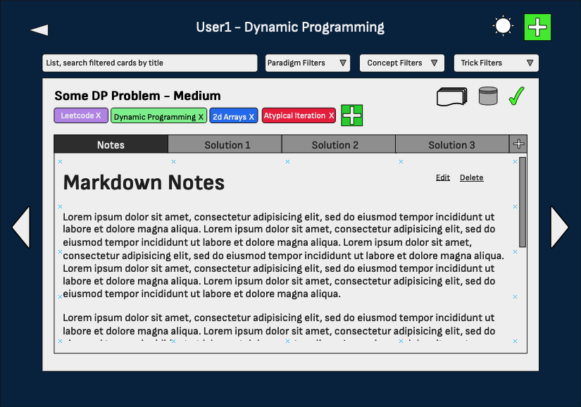

- <a href="#techstack">Tech Stack</a>
- <a href="#datamodel">Data Model</a>
    - <a href="#entities">Entities</a>
    - <a href="#queries">Queries</a>
- <a href="#UI">UI</a>
- <a href="#plan">Implementation Plan</a>

<a id="techstack" href="#techstack" ><u><h1>Tech Stack</h1></u></a>

- **Tauri (Rust)** - cross-platform desktop app framework, leverages webviews for making desktop UIs with web technologies
- **React (TypeScript)** - frontend JS/TS UI framework; component-based, declarative
- **TailwindCSS** - useful CSS utility classes and defaults
- **SQLite** - embedded SQL database, simplifies disk i/o
- **Diesel (Rust)** - ORM for safe, efficient interaction with SQLite

<a id="datamodel" href="#datamodel" ><u><h1>Data Model</h1></u></a>

<h3><a href="#entities" id="entities">Entities</a></h3>

- **Image**
    - id - integer, PK
    - name - text, not null
    - image - blob, not null

- **User**
    - id - integer PK
    - username - text not null unique
    - avatar - integer FK ref Image.id default 1
    - theme - integer FK ref ThemeEnum.enum_val default 1
    - tagmask - integer default 0
    - hidediffs - boolean default false

- **Deck**
    - id - integer PK
    - name - text not null
    - deleted - boolean default false
    - user - integer FK ref User.id on delete cascade not null
    - size - integer default 0
    - mastered - integer default 0
    - Constraint: unique(name,  user)

- **DifficultyEnum**
    - enum_val - integer PK
    - name - text not null unique

- **Source**
    - id - integer PK
    - name - text unique

- **Card**
    - id - integer PK
    - front - integer FK ref CardFront.id not null unique
    - back - integer FK ref CardBack.id not null unique
    - mastered - boolean default false
    - source - integer FK ref Source.id not null
    - shipped - boolean default false
    - difficulty - integer FK ref Difficulty.enum_val not null

- **Card_Deck**
    - rel_id - integer PK
    - card - integer FK ref Card.id on delete cascade not null
    - deck - integer FK ref Deck.id on delete cascade not null

- **CardFront**
    - id - integer PK
    - card - integer FK ref Card.id on delete cascade not null
    - prompt - text not null
    - title - text not null

- **CardBack**
    - id - integer PK
    - card - integer FK ref Card.id on delete cascade not null
    - notes - text not null

- **Solution**
    - id - integer PK
    - name - text not null
    - content - text not null
    - cardback - integer FK ref CardBack.id on delete cascade not null

- **TagTypeEnum**
    - enum_val - integer PK
    - name - text not null

- **Tag**
    - id - integer PK
    - type - integer FK ref TagType.enum_val not null
    - name - text
    - content - text

- **Card_Tag**
    - rel_id - integer PK
    - card - integer FK ref Card.id on delete cascade not null
    - tag - integer FK ref Tag.id on delete cascade not null
    - Constraint: unique(card, tag)

- **ThemeEnum**
    - enum_val - integer PK
    - name - text not null

<h3><a href="#queries" id="queries">Queries</a></h3>
Note: Queries below will be executed via rust with `diesel::QueryDsl` ORM methods (avoiding raw SQL in all queries except where otherwise indicated)

<table>
    <tr>
        <th>Query No.</th><th>Flow</th><th>Description</th><th>Query</th>
    </tr>
    <tr>
        <td><a id="Q1" href="#Q1">Q1</a></td>
        <td><a href="#signinflow">Signin</a></td>
        <td>Get existing users</td>
        <td><pre><code>
SELECT 
    User.id AS id, 
    username, 
    Image.image AS avatar, 
    ThemeEnum.name
FROM 
    User
    LEFT JOIN Image 
        ON User.avatar = Image.id
    LEFT JOIN ThemeEnum 
        ON ThemeEnum.id = User.theme; </code></pre></td>
    </tr>
    <tr>
        <td><a id="Q2" href="#Q2">Q2</a></td>
        <td><a href="#signinflow">Signin</a></td>
        <td>Add image</td>
        <td><pre><code>
INSERT INTO Image (name, image) 
VALUES (name from rust, blob via rust);</code></pre></td>
    </tr>
    <tr>
        <td><a id="Q3" href="#Q3">Q3</a></td>
        <td><a href="#signinflow">Signin</a></td>
        <td>Add User</td>
        <td><pre><code>
INSERT INTO User (username, avatar) 
VALUES (name in rust, image id in rust);
</code></pre></td>
    </tr>
    <tr>
        <td><a id="Q4" href="#Q4">Q4</a></td>
        <td><a href="#signinflow">Signin</a></td>
        <td>Preload a deck with leetcode data</td>
        <td><pre><code>
BEGIN TRANSACTION;
 
SELECT id FROM Source WHERE name LIKE Leetcode;  -- for use in later queries
 
SELECT -- get lc question data
    prompt, 
    title, 
    difficulty, 
    Card_Tag.tag AS tagid 
FROM Card
JOIN CardFront 
    ON Card.shipped 
        AND Card.source = (lc source) 
        AND Card.front = CardFront.id
LEFT JOIN Card_Tag 
    ON Card.id = Card_Tag.card; 
 
INSERT INTO Deck 
    (name, user, size) 
VALUES (
    name via rust, 
    user id via rust, 
    size in rust from above query
);
 
INSERT INTO CardFront (prompt, title)
VALUES (prompts from rust, titles from rust),*;
 
INSERT INTO CardBack (notes) 
VALUES (“”),*; -- as many blank backs as fronts
 
INSERT INTO Card (front, back, difficulty, source) 
VALUES (
    fronts from rust, 
    backs from rust, 
    difficulties from rust, 
    lc id from rust
),*;
 
INSERT INTO Card_Deck (card, deck) 
VALUES (
    card ids from above, 
    deck id from above
),*;
 
INSERT INTO CardFront (card) 
VALUES (cards from above);
 
INSERT INTO CardBack (card) 
VALUES (cards from above);
 
INSERT INTO Card_Tag (card, tag) 
VALUES (
    new card ids from rust, 
    tagids from rust from lc data shipped with app
),*;
 
COMMIT;
</code></pre></td>
    </tr>
    <tr>
        <td><a id="Q5" href="#Q5">Q5</a></td>
        <td><a href="#decksflow">Decks</a></td>
        <td>Get User Decks</td>
        <td><pre><code>
SELECT id, user, name, size, mastered 
FROM Deck 
WHERE user = (user from rust) AND NOT deleted;
</code></pre></td>
    </tr>
    <tr>
        <td><a id="Q6" href="#Q6">Q6</a></td>
        <td><a href="#decksflow">Decks</a></td>
        <td>Delete a deck</td>
        <td><pre><code>
BEGIN TRANSACTION;
 
-- cascade delete Card_Deck rows referencing deleted deck
DELETE FROM Deck 
WHERE id = (deck id from rust);
 
-- delete cards that are no longer in any deck
DELETE FROM Card WHERE id NOT IN (
    SELECT card FROM Card_Deck;
); 
 
COMMIT;
</code></pre></td>
    </tr>
    <tr>
        <td><a id="Q7" href="#Q7">Q7</a></td>
        <td><a href="#decksflow">Decks</a></td>
        <td>Rename deck</td>
        <td><pre><code>
UPDATE Deck SET name = (new name from rust)
WHERE id = (deck id from rust);
</code></pre></td>
    </tr>
    </tr>
    <tr>
        <td><a id="Q8" href="#Q8">Q8</a></td>
        <td><a href="#decksflow">Decks</a></td>
        <td>Add deck</td>
        <td><pre><code>
INSERT INTO Deck (name, user) 
VALUES (name from rust, user id from rust);
</code></pre></td>
    </tr>
    <tr>
        <td><a id="Q9" href="#Q9">Q9</a></td>
        <td><a href="#cardsflow">Cards</a></td>
        <td>View deck</td>
        <td><pre><code>
SELECT 
    Card.id AS id, 
    Card.back AS backid, 
    Deck.card AS deckid,
    Card.mastered as mastered, 
    prompt, 
    title, 
    DifficultyEnum.name AS difficulty, 
    Source.name AS source
FROM
Card
JOIN Card_Deck 
    ON Card.id = Card_Deck.card 
        AND Card_Deck.deck = (selected deck id from rust)
JOIN DifficultyEnum 
    ON Card.difficulty = DifficultyEnum.enum_val
LEFT JOIN Source 
    ON Source.id = Card.source;
</code></pre></td>
    </tr>
    <tr>
        <td><a id="Q10" href="#Q10">Q10</a></td>
        <td><a href="#cardsflow">Cards</a></td>
        <td>Add new card</td>
        <td><pre><code>
BEGIN TRANSACTION;
 
UPDATE Deck SET size = size + 1 
WHERE id = (current deck id from rust);
 
INSERT INTO CardFront (prompt, title)
VALUES (prompt from rust, title from rust);
 
INSERT INTO CardBack (notes) VALUES (“”);
 
INSERT INTO Card (front, back, difficulty, source) 
VALUES (
    front from rust, 
    back from rust, 
    difficulty from rust, 
    source id from rust
);
 
INSERT INTO CardFront (card) VALUES (card id from above);
INSERT INTO CardBack (card) VALUES (card id from above);
 
INSERT INTO Card_Deck (card, deck) VALUES (
    card id from above, 
    deck id from above
);
 
INSERT INTO Card_Tag (card, tag) VALUES (
    card id from above, 
    tag ids from rust
);
 
COMMIT;
</code></pre></td>
    </tr>
    <tr>
        <td><a id="Q11" href="#Q11">Q11</a></td>
        <td><a href="#cardsflow">Cards</a></td>
        <td>Delete card from deck</td>
        <td><pre><code>
BEGIN TRANSACTION;
 
-- check if other decks have this
SELECT COUNT(*) FROM Card_Deck 
WHERE card = (card id from rust);  card)
 
DELETE FROM Card_Deck 
WHERE card = (card id from rust) 
    AND deck = (deck id from rust);
 
UPDATE Deck SET size = size - 1 
WHERE id = (deck id from rust);
 
-- conditional on if the deleted is marked as mastered
UPDATE Deck SET mastered = mastered - 1 
WHERE id = (deck id from rust); 
 
-- conditional on if no other decks use the card.
-- will cascade delete to CardFront,
-- CardBack, Solution, Card_Tag rows
DELETE FROM card WHERE id = (curr card id from rust);
 
COMMIT;
</code></pre></td>
    </tr>
    <tr>
        <td><a id="Q12" href="#Q12">Q12</a></td>
        <td><a href="#cardsflow">Cards</a></td>
        <td>Edit card prompt</td>
        <td><pre><code>
UPDATE CardFront SET prompt = (prompt text from rust) 
WHERE id = (card id from rust);
</code></pre></td>
    </tr>
    <tr>
        <td><a id="Q13" href="#Q13">Q13</a></td>
        <td><a href="#cardsflow">Cards</a></td>
        <td>Associate tag with card</td>
        <td><pre><code>
INSERT INTO Card_Tag (card, tag) 
VALUES (
    card id from rust, 
    tag id from rust
);
</code></pre></td>
    </tr>
    <tr>
        <td><a id="Q14" href="#Q14">Q14</a></td>
        <td><a href="#cardsflow">Cards</a></td>
        <td>Remove tag from card</td>
        <td><pre><code>
DELETE FROM Card_Tag 
WHERE 
    card = (current card id from rust) 
    AND tag = (selected tag id from rust);
</code></pre></td>
    </tr>
    <tr>
        <td><a id="Q15" href="#Q15">Q15</a></td>
        <td><a href="#cardsflow">Cards</a></td>
        <td>Mark/unmark card as mastered</td>
        <td><pre><code>
BEGIN TRANSACTION;
 
UPDATE Card SET mastered = (mastered bool from rust) 
WHERE id = (card id from rust);
 
UPDATE Deck SET mastered = mastered +/- 1 
WHERE id = (current deck id from rust);
 
COMMIT;
</code></pre></td>
    </tr>
    <tr>
        <td><a id="Q16" href="#Q16">Q16</a></td>
        <td><a href="#cardsflow">Cards</a></td>
        <td>Edit card solution</td>
        <td><pre><code>
UPDATE Solution SET 
    content = (edited solution content from rust),
    name = (name from rust) 
WHERE id = (solution id from rust);
</code></pre></td>
    </tr>
    <tr>
        <td><a id="Q17" href="#Q17">Q17</a></td>
        <td><a href="#cardsflow">Cards</a></td>
        <td>Edit card notes</td>
        <td><pre><code>
UPDATE CardBack SET notes = (edited notes from rust) 
WHERE id = (card back id from rust);
</code></pre></td>
    </tr>
    <tr>
        <td><a id="Q18" href="#Q18">Q18</a></td>
        <td><a href="#cardsflow">Cards</a></td>
        <td>Delete solution from card</td>
        <td><pre><code>
DELETE FROM Solution 
WHERE id = (current solution id from rust);
</code></pre></td>
    </tr>
    <tr>
        <td><a id="Q19" href="#Q19">Q19</a></td>
        <td><a href="#cardsflow">Cards</a></td>
        <td>Add solution to card</td>
        <td><pre><code>
INSERT INTO Solution (content, cardback, name) 
VALUES (
    solution content from rust, 
    cardback id from rust,
    name from rust
);
</code></pre></td>
    </tr>
    <tr>
        <td><a id="Q20" href="#Q20">Q20</a></td>
        <td><a href="#cardsflow">Cards</a></td>
        <td>View card solutions</td>
        <td><pre><code>
SELECT content, name FROM Solution 
WHERE cardback = (cardback id from rust);
</code></pre></td>
    </tr>
    <tr>
        <td><a id="Q21" href="#Q21">Q21</a></td>
        <td><a href="#settingsflow">Settings</a></td>
        <td>Open settings page</td>
        <td><pre><code>
// masks indicate which tags, if diffs are hidden from user
SELECT tagmask, hidediffs, theme FROM User 
WHERE id = (user id from rust);
</code></pre></td>
    </tr>
    <tr>
        <td><a id="Q22" href="#Q22">Q22</a></td>
        <td><a href="#cardsflow">Cards</a></td>
        <td>Add card to another deck</td>
        <td><pre><code>
BEGIN TRANSACTION;
 
INSERT INTO Card_Deck (card, deck) 
VALUES (card id from rust, deck id from rust);
 
UPDATE Deck SET size = size + 1 
WHERE id = (deck id from rust);
 
COMMIT;
</code></pre></td>
    </tr>
    <tr>
        <td><a id="Q23" href="#Q23">Q23</a></td>
        <td><a href="#settingsflow">Settings</a></td>
        <td>Change theme</td>
        <td><pre><code>
UPDATE User SET theme = (theme enum_val from rust) 
WHERE id = (user id from rust);
</code></pre></td>
    </tr>
    <tr>
        <td><a id="Q24" href="#Q24">Q24</a></td>
        <td><a href="#settingsflow">Settings</a></td>
        <td>Hide/show tags by type</td>
        <td><pre><code>
UPDATE User SET tagmask = (tagmask from rust) 
WHERE id = (user id from rust);
</code></pre></td>
    </tr>
    <tr>
        <td><a id="Q25" href="#Q25">Q25</a></td>
        <td><a href="#settingsflow">Settings</a></td>
        <td>Hide/show difficulty</td>
        <td><pre><code>
UPDATE User SET hidediffs = (hide bool from rust) 
WHERE id = (user id form rust);
</code></pre></td>
    </tr>
    <tr>
        <td><a id="Q26" href="#Q26">Q26</a></td>
        <td><a href="#settingsflow">Settings</a></td>
        <td>Delete user</td>
        <td><pre><code>
BEGIN TRANSACTION;
 
DELETE FROM Image 
WHERE id = (current user.avatar from rust);
 
// will cause a cascade delete User -> Deck -> Card_Deck)
DELETE FROM User 
WHERE id = (user id from rust); 
 
DELETE FROM Card // delete all user’s cards
WHERE id NOT IN (
    SELECT card FROM Card_Deck
); 
 
COMMIT;
</code></pre></td>
    </tr>
    <tr>
        <td><a id="Q27" href="#Q27">Q27</a></td>
        <td><a href="#cardsflow">Cards</a></td>
        <td>Add new source</td>
        <td><pre><code>
INSERT INTO Source (name) 
VALUES (new source name from rust);
</code></pre></td>
    </tr>
    <tr>
        <td><a id="Q28" href="#Q28">Q28</a></td>
        <td><a href="#cardsflow">Cards</a></td>
        <td>Create new tag</td>
        <td><pre><code>
-- for paradigm tags content will be null
-- and may be null for concept or trick tags
INSERT INTO Tag (type, name, content)
VALUES (
    enum val from above via rust, 
    name from rust, 
    content from rust
); 
</code></pre></td>
    </tr>
    <tr>
        <td><a id="Q29" href="#Q29">Q29</a></td>
        <td><a href="#cardsflow">Cards</a></td>
        <td>Get tags of card</td>
        <td><pre><code>
SELECT
    TagTypeEnum.name AS type,
    Tag.id AS id,
    Tag.name AS name,
    Tag.content AS content,
    Card_Tag.id AS cardid
FROM
Tag
JOIN Card_Tag 
    ON Card_Tag.card = (card id from rust)
LEFT JOIN TagTypeEnum 
    ON TagTypeEnum.enum_val = Tag.type;
</code></pre></td>
    </tr>
    <tr>
        <td><a id="Q30" href="#Q30">Q30</a></td>
        <td>n/a</td>
        <td>Fill enum entities</td>
        <td><pre><code>
INSERT INTO DifficultyEnum (name) 
VALUES ("Easy"), ("Medium"), ("Hard");
 
INSERT INTO TagTypeEnum (name)
VALUES ("Paradigm"), ("Concept"), ("Trick");
 
INSERT INTO ThemeEnum (name)
VALUES ("Normal"), ("Dark");
</code></pre></td>
    </tr>
    <tr>
        <td><a id="Q31" href="#Q31">Q31</a></td>
        <td>n/a</td>
        <td>Preload leetcode as a question source</td>
        <td><pre><code>
INSERT INTO Source (name) 
VALUES ("Leetcode");
</code></pre></td>
    </tr>
    <tr>
        <td><a id="Q32" href="#Q32">Q32</a></td>
        <td>n/a</td>
        <td>
            Preload tags (Note: will probably have these default tag names embedded in backend rust code, which will be read on first time app runs and inserted into the sqlite db)
        </td>
        <td><pre><code>
INSERT INTO Tag (type, name, content)
VALUES
(0, "Dynamic Programming", null),
(0, "Math", null),
(0, "Greedy", null),
(0, "Graph", null),
(0, "Design", null),
(0, "Simulation", null),
(0, "Backtracking", null),
(0, "Counting", null),
(0, "Enumeration", null),
(0, "Recursion", null),
(0, "Divide and Conquer", null),
(0, "Memoization", null),
(0, "Geometry", null),
(0, "Number Theory", null),
(0, "Game Theory", null),
(0, "Data Stream", null),
(0, "Combinatorics", null),
(0, "Randomized", null),
(0, "Iterator", null),
(0, "Probability", null),
(1, "Array", null),
(1, "String", null),
(1, "Hash Table", null),
(1, "Sorting", null),
(1, "Depth-First Search", null),
(1, "Breadth-First Search", null),
(1, "Tree", null),
(1, "Binary Search", null),
(1, "Matrix", null),
(1, "Binary Tree", null),
(1, "Two Pointers", null),
(1, "Bit Manipulation", null),
(1, "Stack", null),
(1, "Heap", null),
(1, "Prefix Sum", null),
(1, "Sliding Window", null),
(1, "Union Find", null),
(1, "Linked List", null),
(1, "Ordered Set", null),
(1, "Monotonic Stack", null),
(1, "Trie", null),
(1, "Binary Search Tree", null),
(1, "Queue", null),
(1, "Bitmask", null),
(1, "Segment Tree", null),
(1, "Topological Sort", null),
(1, "Hash Function", null),
(1, "Binary Indexed Tree", null),
(1, "Monotonic Queue", null),
(1, "Merge Sort", null),
(1, "Doubly-Linked List", null),
(1, "Quickselect", null),
(1, "Bucket Sort", null),
(1, "Reservoir Sampling", null),
(1, "Counting Sort", null),
(1, "Radix Sort", null),
(1, "Rejection Sampling", null),
(1, "Eulerian Circuit", null),
(1, "Line Sweep", null);
</code></pre></td>
    </tr>
    <tr>
        <td><a id="Q33" href="#Q33">Q33</a></td>
        <td>n/a</td>
        <td>Preload leetcode questions</td>
        <td><pre><code>
INSERT INTO User (username) VALUES ("");
 
INSERT INTO Deck (name, user) VALUES ("", 1);
 
-- from here, many calls to wrapper functions of Q10 
-- and Q13 (add new card, associate new tag) 
-- will be invoked via rust using leetcode 
-- question data loaded into rust memory from json file
</code></pre></td>
    </tr>
    <tr>
        <td><a id="Q34" href="#Q34">Q34</a></td>
        <td><a href="#cardsflow">Cards</a></td>
        <td>Get card notes</td>
        <td><pre><code>
SELECT notes FROM CardBack 
WHERE id = (card back id from rust);
</code></pre></td>
    </tr>
    <tr>
        <td><a id="Q35" href="#Q35">Q35</a></td>
        <td>n/a</td>
        <td>Load enums</td>
        <td><pre><code>
SELECT * FROM ThemeEnum;
 
SELECT * FROM DifficultyEnum;
 
SELECT * FROM TagTypeEnum;
</code></pre></td>
    </tr>
</table>

<a id="UI" href="#UI" ><u><h1>UI</h1></u></a>

<h3><a id="signinflow" href="#signinflow">Signin</a></h3>

- Load users ([Q1](#Q1))
- Login as user by clicking on an avatar/username ([Q5](#Q5))
- Add user ([Q3](#Q3))
    - Show add user form
    - Add avatar ([Q2](#Q2))
    - Prefill a deck with leetcode questions ([Q4](#Q4))
    - Display add success or add failed. If fail, give reason (too many users already, name already taken)

<h3><a id="decksflow" href="#decksflow">Decks</a></h3>

- Open settings page ([Q21](#Q21))
- Load user's decks ([Q5](#Q5))
- View deck ([Q9](#Q9), [Q29](#Q29))
- Rename deck ([Q7](#Q7))
- Delete deck ([Q6](#Q6))
- Add new deck ([Q8](#Q8))
    - Show add deck form
    - Display add success or add failed. If fail, give reason (name already taken)

<h3><a id="cardsflow" href="#cardflow">Cards</a></h3>

- Load deck cards info ([Q9](#Q9), [Q29](#Q29))
- Add a new card ([Q10](#Q10))
    - Show add card form
    - Add new card source ([Q27](#Q27))
    - Display add success or add failed. If fail, give reason (name already taken)
- Add card to another deck ([Q22](#Q22))
    - List decks to add to ([Q5](#Q5))
- Remove card from deck ([Q11](#Q11))
- Mark/unmark card as mastered ([Q15](#Q15))
- Text search for card by title ([Q9](#Q9), [Q29](#Q29))
- Filter by paradigm, concept, trick ([Q9](#Q9), [Q29](#Q29))
- Open settings page ([Q21](#Q21))
- Flip card ([Q34](#Q34), [Q20](#Q20))
- Add new tag ([Q28](#Q28))
    - Show add tag form
    - List tag types ([Q28](#Q28))
    - Display add success or add failed. If fail, give reason (name already taken)
- Associate a tag with a card ([Q13](#Q13))
- Remove a tag association from a card ([Q14](#Q14))

###### Card front

- Edit prompt ([Q12](#Q12))

###### Card back

- Edit card notes ([Q17](#Q17))
- Edit card solution ([Q16](#Q16))
- Add card solution ([Q19](#Q19))
- Delete card solution ([Q18](#Q18))
- View other solution/notes ([Q34](#Q34), [Q20](#Q20))
- Flip card ([Q9](#Q9), [Q29](#Q29))

<h3><a id="settingsflow" href="#settingsflow">Settings</a></h3>

- Load current settings ([Q21](#Q21), [Q1](#Q1))
- Change color theme ([Q23](#Q23))
- Change difficulty/tag hiding settings ([Q24](#Q24), [Q25](#Q25))
- Delete user ([Q26](#Q26))

<h1><a href="#plan" id="plan">Implementation Plan</a></h1>

### Phase 1

__**__ = should be tested but implementing the tests not part of current phase

__****__ = can be put off until first release/need for creation of final distribution binaries

- **[ ✅ ]** Init tauri app with react for ui: 
    - https://create-react-app.dev/docs/getting-started#creating-a-typescript-app
    - https://tailwindcss.com/docs/installation
    - https://tauri.app/v1/guides/getting-started/setup/next-js (but use create-react-app instead)
- Init db
    - Be sure to use: https://docs.rs/diesel_migrations/2.0.0/diesel_migrations/macro.embed_migrations.html#, and description about it in https://diesel.rs/guides/getting-started. Will simplify creation of distribution binaries.
    - Diesel migration for defining all entities, filling custom enums
        - [Q30](#Q30) for filling enums
        - See https://docs.diesel.rs/2.0.x/diesel/sqlite/struct.SqliteConnection.html about `diesel::sqlite::SqliteConnection::establish`. No need to worry about creating an `sqlite.db` file on first run of final binary. Passed URL should be something like `"sqlite://sqlite.db"`.
    - will need to `PRAGMA foreign_keys = ON` via Diesel connection (`conn.batch_execute(“PRAGMA foreign_keys = ON”)`) everytime for FKs/cascade deletes to work; will also need to ensure shipped version of sqlite compiles with neither SQLITE_OMIT_FOREIGN_KEY nor SQLITE_OMIT_TRIGGER defined or enabling FK functionality via the PRAGMA will be useless (https://www.sqlite.org/foreignkeys.html).
    - __****__ Will need to explicitly embed used version of sqlite binary into distributed binaries. See https://github.com/diesel-rs/diesel/issues/1860 and https://crates.io/crates/libsqlite3-sys section titled "Notes on building rusqlite and libsqlite3-sys"; this will be much easier than going https://tauri.app/v1/api/config#bundleconfig route, as long as the bundled binary gets compiled with appropriate flags to allow foreign key/cascade delete support. If need to go the latter route, may consider compiling sqlite myself with appropriate flags and embedding the resulting binary, setting the `SQLITE3_LIB_DIR` environment variable.
    - Diesel migration for preloading leetcode data
        - __**__ Write script that hits public Leetcode graphql API, reads relevant information and translates to raw sql for `up.sql` and `down.sql` diesel migration files (command-f 'up.sql' on https://diesel.rs/guides/getting-started).
        - See [Q10](#Q10), [Q13](#Q13), [Q31](#Q31), [Q32](#Q32), [Q33](#Q33). Generated SQL should be an aggregation of these.

### Phase 2

- Static react components - no interactivity or Tauri command invocations
    - Components should adhere to single responsibility principle, and reasonably balance reusability with overcomplication.
    - just markdown renderer? https://github.com/uiwjs/react-markdown-preview
    - or editor too? https://github.com/uiwjs/react-markdown-editor
    - ## TODO: more details

### Phase 3
- __**__ Wrapper functions for above queries (in-memory sqlite to mock the real thing)
- __**__ Tauri commands, which call query wrappers. How these commands get implemented should be clearer after finishing all static components.
    - Think about how calling components should store certain data (current user, current deck, current card, current filters, etc. vs enums and other more static app data) in the frontend (React.context? Redux?) instead of reading the same stuff over and over from disk.
    - ## TODO: more details

### Phase 4

- Make the frontend call the Tauri commands and add interactivity to the static components. The app should be a fully functional MVP after this phase.
    - ## TODO: more details

### Phase 5
- Test all above functionality annotated as needing it
- Playwright for e2e testing?
- ## TODO: more details

### Phase 6
- Add more color themes?
- other ideas?